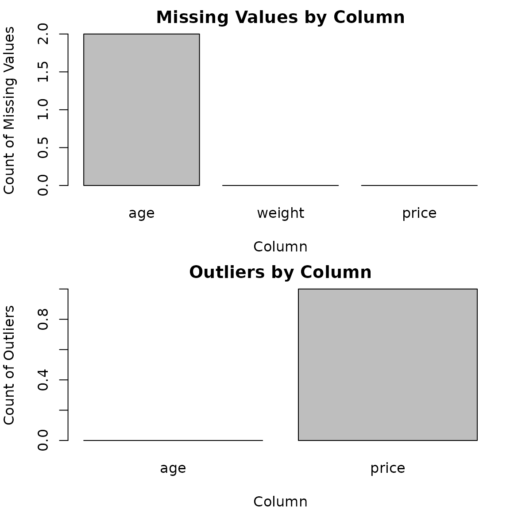

# validateR

## Introduction

Real-world data is rarely clean. A column might have missing values that
are easy to overlook. A few extreme (outlier) values might sneak into an
otherwise normal numeric column. Rows sometimes get duplicated by
accident during data collection or when merging files. A column that
should be numeric can end up stored as text, just because a few entries
contain things like `"N/A"` or `"unknown"`. And a column of dates can
have a few entries that don’t match the format the rest of the column
uses.

`validateR` is a small set of tools that helps you catch these problems
before they affect your analysis. It checks a data frame for five common
issues:

- **Missing values** — how many values are missing in each column, and
  what percentage that represents
- **Outliers** — unusually extreme numeric values, detected using the
  IQR method
- **Duplicate rows** — rows that are exact copies of each other, grouped
  so you can see which rows match
- **Numeric-like inconsistencies** — text columns that look like they
  were meant to hold numbers, but have a few values that don’t convert
  cleanly
- **Date-like inconsistencies** (optional) — text columns that look like
  they were meant to hold dates in a format you specify, but have a few
  values that don’t parse cleanly

This vignette walks through a complete example: starting with a messy
data frame, running a check, and reading the results.

``` r

library(validateR)
```

## A messy example

Let’s create a small data frame with a few realistic problems: a missing
value, an outlier, a duplicated row, and a text column that should
probably be numeric.

``` r

messy_data <- data.frame(
  age = c(25, 12, NA, 17, 19), 
  weight = c("45", "34", "25", "N/A", "32"),
  price = c(100, 120, 140, 1500, 125)
)
messy_data <- rbind(messy_data, messy_data[3, ])
messy_data
#>    age weight price
#> 1   25     45   100
#> 2   12     34   120
#> 3   NA     25   140
#> 4   17    N/A  1500
#> 5   19     32   125
#> 31  NA     25   140
```

## Running `validate_df()`

The main entry point is
[`validate_df()`](https://ugyennorbu.github.io/validateR/reference/validate_df.md).
It runs four checks automatically, and returns a single report object. A
fifth check, for date-like columns, is available too, but only runs if
you ask for it — more on that later in this vignette.

``` r

report <- validate_df(messy_data)
report
#> < validation_report for 'messy_data' >
#> 6 rows, 3 columns
#> Checked: 2026-09-12 04:07:47 
#> 
#> Missing values:          1  column(s) affected
#> Outliers:                1  column(s) affected
#> Duplicates:              1  group(s) affected
#> Numeric-like issues:     1  column(s) affected
#> Date-like issues:        NOT checked 
#> 
#> For details, inspect report$results$missing, $outliers, $duplicates, $numeric_like, $date_like
```

## Looking at the details

The printed summary tells you *how many* columns were affected by each
check, but not the specifics. The full results are stored inside the
report object, under `report$results`, and are worth exploring directly
when you need to act on what was found.

### Missing values

`report$results$missing` is a data frame with one row per column,
showing the count and percentage of missing values.

``` r

report$results$missing
#>   column_name n_missing pct_missing
#> 1         age         2       33.33
#> 2      weight         0        0.00
#> 3       price         0        0.00
```

Here, `age` has two missing values out of six rows, while `weight` and
`price` have none. If a column had a high percentage of missing values,
this table would make that immediately clear, without needing to
visually inspect the raw data.

### Outliers

`report$results$outliers` is also a data frame, one row per *numeric*
column, showing how many values were flagged as outliers using the IQR
method.

``` r

report$results$outliers
#>   column_name n_outliers pct_outliers
#> 1         age          0         0.00
#> 2       price          1        16.67
```

`price` shows one outlier, which is the `1500` value standing well apart
from the rest of the column. `age` shows none. Note that non-numeric
columns, like `weight`, don’t appear here at all, since outlier
detection only makes sense for numeric data.

### Duplicate rows

`report$results$duplicates` is a list, rather than a data frame. Each
element, representing a group of duplicate rows, has row numbers that
are exact duplicates of each other.

``` r

report$results$duplicates
#> [[1]]
#> [1] 3 6
```

This shows one group, containing rows 3 and 6 — the row we duplicated on
purpose when building the example data. If there were several separate
groups of duplicate rows, each would appear as its own element in this
list.

### Numeric-like inconsistencies

`report$results$numeric_like` is a named list, with one element per
column that looks like it was meant to be numeric but contains some
values that don’t convert cleanly.

``` r

report$results$numeric_like
#> $weight
#> $weight$expected_type
#> [1] "numeric"
#> 
#> $weight$proportion_convertible
#> [1] 83.33
#> 
#> $weight$bad_rows
#> [1] 4
```

The `weight` column is flagged here: about 83% of its values convert to
numbers, and the one value that doesn’t (`"N/A"`, in row 4) is listed
under `bad_rows`. This is enough information to go back to the original
data and decide whether to fix, remove, or investigate that value.

## Visualizing the results

For a quick visual overview,
[`plot()`](https://rdrr.io/r/graphics/plot.default.html) shows two bar
charts: missing value counts and outlier counts, one column per bar.

``` r

plot(report)
```



## Running checks individually

Sometimes you don’t need the full report — maybe you already know your
data is fine except for one specific concern. Each check function used
by
[`validate_df()`](https://ugyennorbu.github.io/validateR/reference/validate_df.md)
is also exported and can be used on its own.

``` r

check_outliers(messy_data)
#>   column_name n_outliers pct_outliers
#> 1         age          0         0.00
#> 2       price          1        16.67
```

This runs just the outlier check, without computing the others. The same
applies to
[`check_missing()`](https://ugyennorbu.github.io/validateR/reference/check_missing.md),
[`check_duplicates()`](https://ugyennorbu.github.io/validateR/reference/check_duplicates.md),
[`check_numeric_like()`](https://ugyennorbu.github.io/validateR/reference/check_numeric_like.md),
and
[`check_date_like()`](https://ugyennorbu.github.io/validateR/reference/check_date_like.md).

## How the thresholds work

Some of the checks make a judgment call about what counts as a problem.
It’s worth understanding how each one decides, so you know when to trust
the default behavior and when you might want to inspect the results more
closely yourself.

### Outliers: the IQR method

[`check_outliers()`](https://ugyennorbu.github.io/validateR/reference/check_outliers.md)
flags a value as an outlier using a method commonly used in boxplots.
For each numeric column, it calculates the interquartile range (IQR) —
the spread between the 25th and 75th percentile of the values. A value
is flagged if it falls more than 1.5 times the IQR below the 25th
percentile, or more than 1.5 times the IQR above the 75th percentile.

This method doesn’t assume the data follows any particular distribution,
and it adapts to the natural spread of each column, so a
